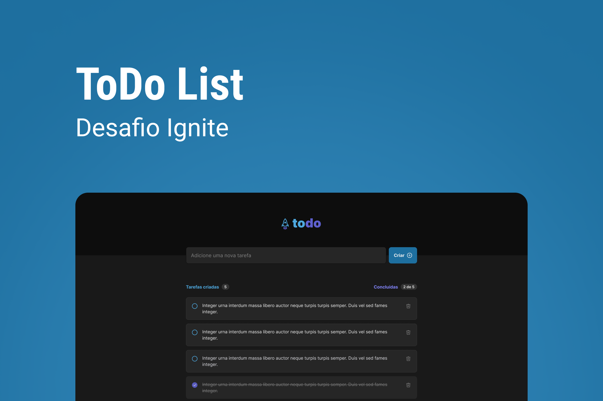

# Todo list ✍🏻

## 📲 [Link do deploy](todo-list-tayhsn.vercel.app)

## 📑 Sobre o projeto

Esta é aplicação é o desafio de entrega do Módulo "Fundamentos de React.js" do Ignite, curso de especialização em Reactjs da Rocketseat.

[Layout](<https://www.figma.com/file/5q5f4nzDGCe5F9h1HwZaFy/ToDo-List-(Copy)?node-id=0%3A1>)

## ✍🏻 Funcionalidades

- Adicionar uma nova tarefa 
    - Verficação do input
    - Envio da mensagem com 'Enter'
- Marcar uma tarefa como feita
- Deletar a tarefa
- Contador de tarefas feitas

## 🧠 Aprendizados

Esse módulo aborda conceitos de:
- Estado
- Imutabilidade 
- Componetização

- Utilizei o `useEffect` para implementar o contador de tarefas.

## 🛠 Tecnologias utilizadas

- Vite
- Typescript
- React
- Tailwindcss
- Postcss
- Phosphor-Icons
- Classnames
